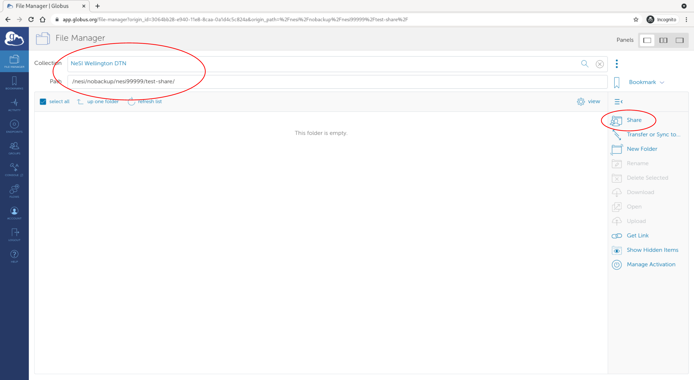
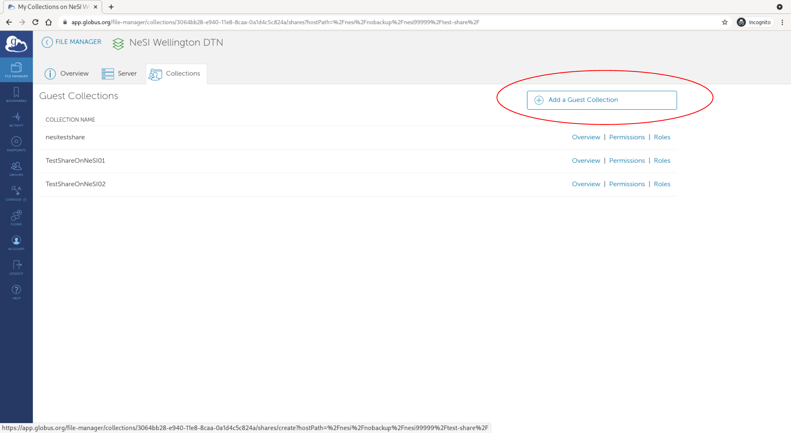
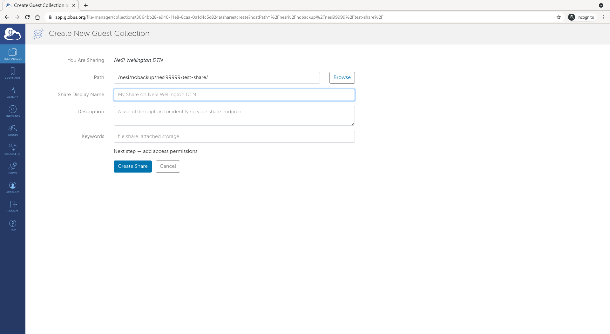
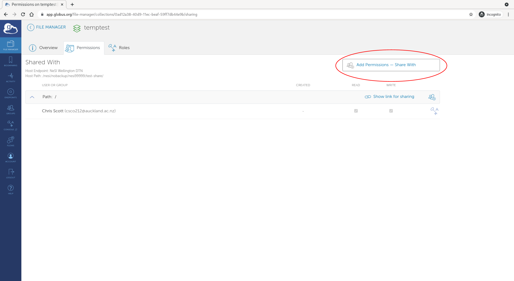
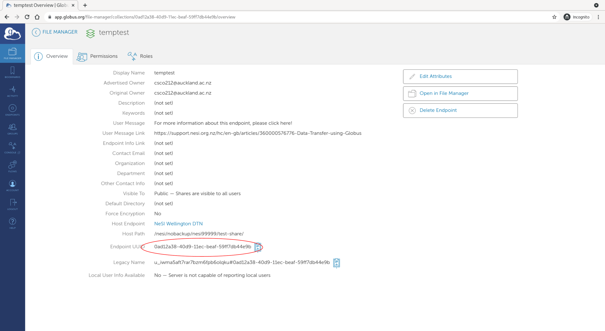

# Globus sync directory

Synchronise directories between Globus shared collections. Files and
directories will be synchronised from the specified directory on the source
endpoint to the destination endpoint. Multiple source and destination
endpoints can be specified.

```
GlobusSharedCollection
│
└───dirtoshare
    │   file011.txt
    │   file012.txt
    │
    └───subfolder1
        │   file111.txt
        │   file112.txt
        │   ...
```

* Files will only be copied if they do not already exist on the destination
  endpoint or if their checksums do not match (i.e. they were modified on the
  source endpoint)
* Files removed from the source collection will not be removed from the
  destination collection if they already exist there
* No files will be changed on the source endpoint (read-only access required)
* Transfers can be stopped and resumed later (using checksums), e.g. by
  setting a time limit in the config file

## Requirements

### Register the app with Globus (one time setup)

We are using [client credentials authentication](https://globus-sdk-python.readthedocs.io/en/stable/examples/client_credentials.html) to authenticate the app directly with Globus.

1. You must register the app and get a Client ID: https://globus-sdk-python.readthedocs.io/en/stable/examples/client_credentials.html#get-a-client
   1. Go to [developers.globus.org](https://developers.globus.org/)
   2. Click *Register your app with Globus*
   3. Click *Add another project*, give it a project name, e.g. *Sync Directory* and enter a contact email
   4. On the project, click *Add* and *Add new app*
      * Give the app a name, e.g. *Sync Directory App*
      * Make sure *Native App* is **not** selected
      * Enter the following scopes: 
        - openid
        - profile
        - email
        - urn:globus:auth:scope:transfer.api.globus.org:all
      * Add the following redirect: https://localhost
      * Create the app
   5. Make a note of the *Client ID*
   6. Click *Generate New Client Secret* and make a note of the secret
3. Store the client id in the config file in the *globus* section, named *clientid*
4. Store the secret in a file somewhere secure, e.g. *~/.globus_sync_directory_secret*
5. If you are using a personal endpoint, make sure sharing is enabled (Preferences -> Access -> Shareable)

### Globus Endpoint

You need to have a Globus end point running with access to the source data and another at the destination (e.g. the
NeSI managed endpoint for the destination).

If you are using a personal endpoint, make sure you have enabled sharing for the relevant locations. This is a setting
within the personal endpoint software. For example, on a Mac you would set this by opening the application preferences and enabling
sharing there.

### Shared collections for each directory you want to synchronise

Create source and destination shared globus collections through the [Globus web app](https://app.globus.org/).

1. Locate the directory of the shared collection in the [Globus file manager](https://app.globus.org/file-manager) on
   your endpoint (this will be the directory that contains the files and/or directories to
   be synchronised) and select the "Share" option

   

2. On the share settings page, select "Add a Guest Collection"

   

3. On the "Create New Guest Collection" page, make sure the path is correct and give the share a name

   

4. After creating the share, you should be on the permissions page for the share, where you can select "Add Permissions - Share With" and
   share the collections with the app we created previously (enter the following as the username to share with: *<CLIENT_ID>@clients.auth.globus.org*)

   

5. Make a note of the shared collection endpoint id (and path relative to the shared collection "Host path" that you want to share) so you can add them to the config file later

   

## Installation

You only need to do this installation once:

1. Open a terminal (e.g. via https://jupyter.nesi.org.nz) and clone this repo somewhere, e.g.
   ```
   git clone https://github.com/chrisdjscott/globus_sync_directory.git ~/globus_sync_directory
   ```
2. Load a Python module:
   ```
   ml purge
   ml Python/3.8.2-gimkl-2020a
   ```
3. Create a virtual environment and install this package:
   ```
   python -m venv venv
   source venv/bin/activate
   pip install .
   ```
4. Create a config file and edit it:
   ```
   cd ~/globus_sync_directory
   cp config.ini.example config.ini
   # edit config.ini
   ```

## Automation on NeSI

You could automate running the sync via `scrontab` on NeSI using the wrapper script provided and the following steps.
Make sure you have followed the installation section above first.

1. Open your scrontab:
   ```
   export EDITOR=nano  # set your favourite editor
   scrontab
   ```
2. Add the following lines, which will start the sync at midnight NZ time daily (note times in `scrontab` are in UTC, so the 12 belows specifies midnight UTC) and follow up with a status update at 7am (19:00 UTC, the `-d` argument means don't start a new transfer, just print the status of the current/last transfer):
   ```
   #SCRON -t 05:00
   0 12 * * * $HOME/globus_sync_directory/nesi_sync_directory_wrapper.sh
   
   #SCRON -t 05:00
   0 19 * * * $HOME/globus_sync_directory/nesi_sync_directory_wrapper.sh -d
   ```
3. Your scheduled cron job should show up in the Slurm queue: `squeue -u $USER`
   - Output from the jobs will show up in: *~/globus_sync_directory/globus_sync_directory.log*
   - You can query the state of the most recent job, if any, by running: `python -m globus_sync_directory -d` from the repo directory, after following
     the "Running manually on NeSI" steps below

## Running manually on NeSI

This assumes you have followed the installation steps above

1. Start a new terminal on NeSI (e.g. via JupyterLab)
2. Change to the `globus_sync_directory` directory
   ```
   cd ~/globus_sync_directory
   ```
4. Load a Python module:
   ```
   ml purge
   ml Python/3.8.2-gimkl-2020a
   ```
5. Source the virtual environment:
   ```
   source venv/bin/activate
   ```
6. Check the status of any active or recently completed transfer:
   ```
   python -m globus_sync_directory -d
   ```
7. Start new transfers if they aren't already running:
   ```
   python -m globus_sync_directory
   ```
